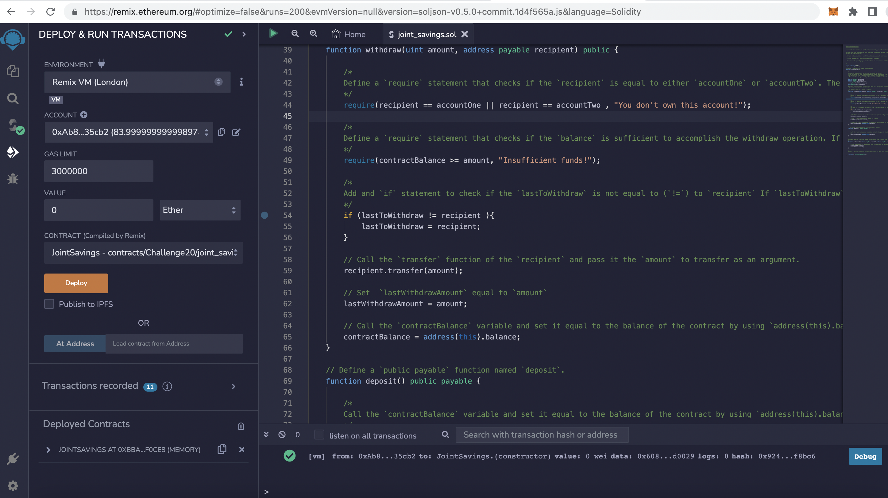
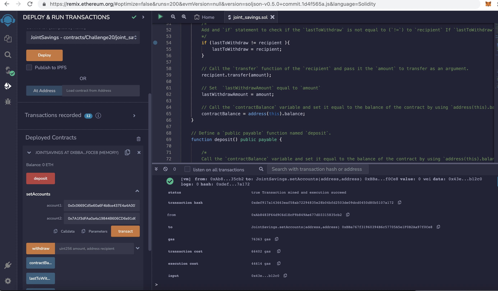
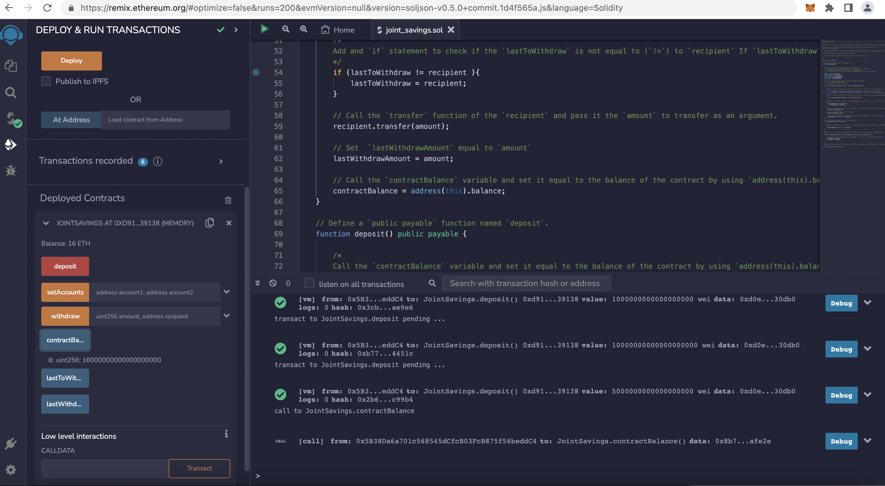
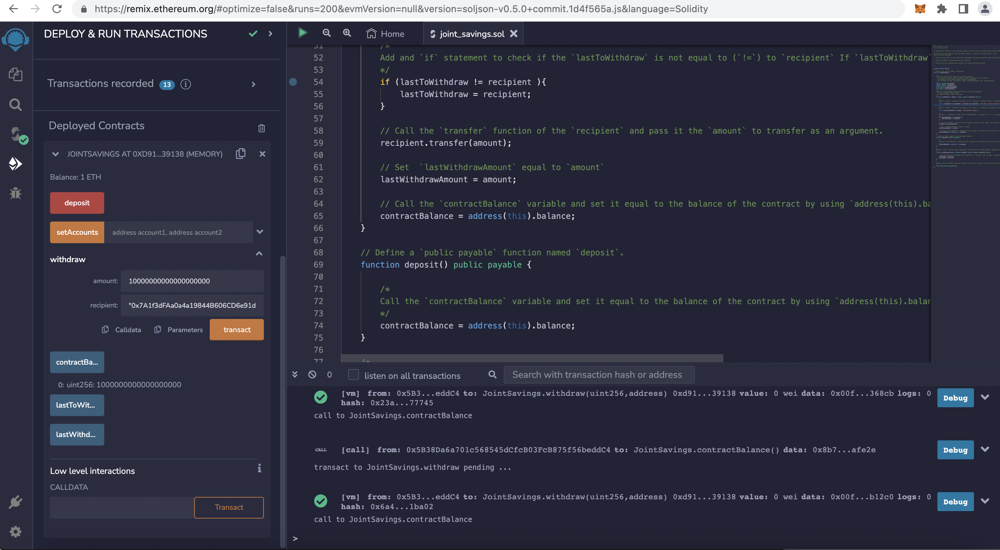

# solidity_joint_account

The **solidity_joint_account** creates Solidity smart contract that accepts two user addresses. These addresses will be able to control a joint savings account. The smart contract will use ether management functions to implement a financial institution’s requirements for providing the features of the joint savings account. These features will consist of the ability to deposit and withdraw funds from the account.


---

## Technologies

This project leverages solidity with the following packages:

* [solidity](https://soliditylang.org/) - For creating the ethereum smart contract
* [Remix - Ethereum IDE](https://remix.ethereum.org) - For compiling and deploying the ethereum smart contract 


---

## Installation Guide

Use Remix Ethereum IDE to compile and deploy the ethereum smart contract (joint_savings.sol)

---


## Usage

To use the **solidity_joint_account**  application simply clone the repository and run the **joint_savings.sol** with Remix IDE:

```python
    Use Remix Ethereum IDE to compile and deploy the ethereum smart contract (joint_savings.sol)
```


solidity_joint_account screen shots

Deployed_JointSavings_Contract



Executed_JointSavings.setAccounts


Deposited_16ETH_in_JointSaving_Contract



Withdrew_15ETH_from_JointSaving_Contract

---

## Contributors

Kausar Hina

---

## License

MIT


